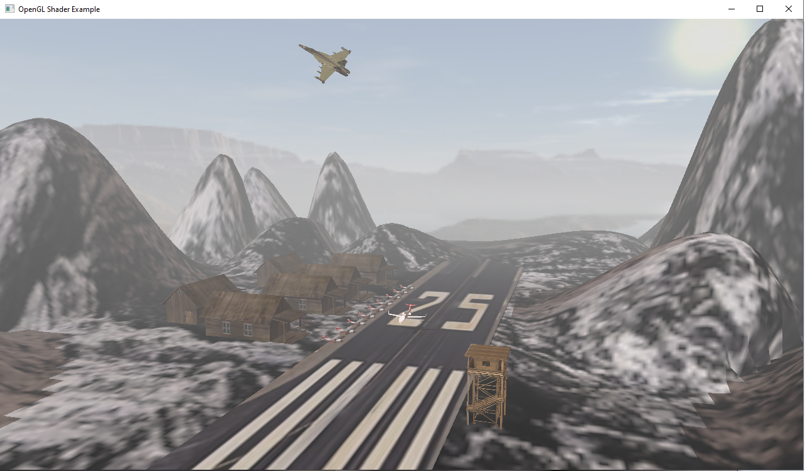

# LulkaAirportReplicaOpenGL

## Description
- This project was done in the 3rd year at Technical University of Cluj-Napoca, as part of Graphic Processing course.

- This project was part of the laboratory work in which each student needed to implement, during the semester, a rendering application. The specific features, such as which objects to include, how the lighting is configured, and its appearance, were determined individually by each student based on their own ideas.

## Contents
Inside the repository are the files forming the project. Each file covers a step in the process of rendering the scene. <br>

## Instalation

### Requirements

In order to run the ```main.cpp``` and get the scene render to the screen, you will need to make sure that you have the following:
1. [Visual Studio](https://visualstudio.microsoft.com/)
2. [GLFW Source Packege](https://www.glfw.org/download.html) library
3. [GLEW](https://glew.sourceforge.net/) library
4. [GLM](https://sourceforge.net/projects/glm.mirror/) library
5. [CMake](https://cmake.org/download/)

<br>

After that, you need to compile the GLFW and GLEW libraries and link them to the Visual Studio. 
A good starting point is this [tutorial](https://www.youtube.com/watch?v=uO__ntYT-2Q&t=264s), GLEW having similar steps as GLAD. 

### Running the app

- After you have installed the required libraries and done all the linking necessary, you can now clone the repo.

- Once you have the files downloaded you can create an empty VS project that has GLFW, GLEW and GLM linked.

- Then you can copy the files of the repo inside the VS project and run the program.
- Upon succes you will be greated with this view 

### Controls
- W, A, S, D for movement.
- X to move the camera upwards vertically.
- Z to move the camera downwards vertically. 
- Mouse Left Click to activate/deactivate the camera movement.
- C,V change the camera movement speed.
- Q, E to change the airplane orientation.
- B to slow the airplane.
- N to speed up the airplane.
- J,L change the light orientation makeing the shadows also move.
- M to show the Shadow Map
- P change the Polygon Drawing Mode
    - Normal
    - Wire Frame
    - Point only.
- R automatic scene display.
- ESC to exit.


